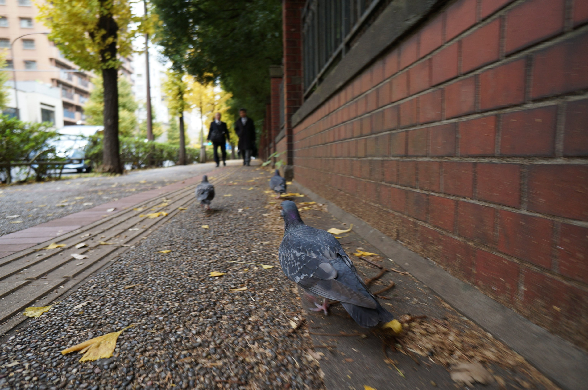
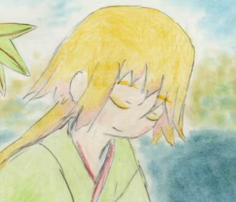

# AVIF Example files from [Link-U](https://www.link-u.co.jp/)

All files does not contain Exif metadata and are tagged as MIAF compatible.  
All files are tagged as compatible with the AVIF Baseline or Advanced Profile if possible.  
All images are licensed under [CC-BY-SA 4.0](https://creativecommons.org/licenses/by-sa/4.0/deed.en).

[Makefile](Makefile) describes how they were created. To generate files yourself, you have to install [cavif](https://github.com/link-u/cavif) and [davif](https://github.com/link-u/davif)

Additional test images may to be added. Please check [our repositories](https://github.com/link-u/avif-sample-images) for them.

## hato

 - size: 3082x2048
 - By Kaede Fujisaki ([@ledyba](https://github.com/ledyba))
 - Downloaded from [her website](https://hexe.net/2017/11/27/12:27:02/).

### AVIF version

#### YUV 420

| profile | bit depth | Monochrome | CDEF | Loop Restration | file                                                                      |
|---------|-----------|------------|------|-----------------|---------------------------------------------------------------------------|
| 0       | 8         |            | NO   | YES             | [here](hato.profile0.8bpc.yuv420.no-cdef.avif)                            |
| 0       | 8         | YES        | NO   | YES             | [here](hato.profile0.8bpc.yuv420.monochrome.no-cdef.avif)                 |
| 0       | 10        |            | NO   | NO              | [here](hato.profile0.10bpc.yuv420.no-cdef.no-restoration.avif)            |
| 0       | 10        | YES        | NO   | NO              | [here](hato.profile0.10bpc.yuv420.monochrome.no-cdef.no-restoration.avif) |

#### YUV422

| profile | bit depth | Monochrome | CDEF | Loop Restration | file                                                                      |
|---------|-----------|------------|------|-----------------|---------------------------------------------------------------------------|
| 0       | 8         |            | NO   | YES             | [here](hato.profile2.8bpc.yuv422.no-cdef.avif)                            |
| 0       | 8         | YES        | NO   | YES             | [here](hato.profile2.8bpc.yuv422.monochrome.no-cdef.avif)                 |
| 0       | 10        |            | NO   | YES             | [here](hato.profile2.10bpc.yuv422.no-cdef.no-restoration.avif)            |
| 0       | 10        | YES        | NO   | NO              | [here](hato.profile2.10bpc.yuv422.monochrome.no-cdef.no-restoration.avif) |
| 0       | 12        |            | NO   | NO              | [here](hato.profile2.12bpc.yuv422.no-cdef.no-restoration.avif)            |
| 0       | 12        | YES        | NO   | NO              | [here](hato.profile2.12bpc.yuv422.monochrome.no-cdef.no-restoration.avif) |

## Kimono - Transformation tests

 - size: 722x1024
 - By Momiji Jinzamomi([@momiji-san](https://github.com/momiji-san)) and Kaede Fujisaki ([@ledyba](https://github.com/ledyba))
 - Downloaded from [their website](https://hexe.net/2017/11/27/12:27:02/).

Test images for rotation(`irot`), mirroring(`imir`), cropping(`clap`).

All AVIF images are encoded in these settings:

 - Profile 0
 - YUV420
 - 8 bits per component

### FYI: Transform operation order

[MIAF](https://www.iso.org/standard/74417.html) defines the transform operation order(p.16):

> These properties, if used, shall be indicated to be applied in the following order:  
>  clean aperture first, then rotation, then mirror.

### Identity

[kimono.avif](./kimono.avif)

No operation is applied.

### Rotation 90

[kimono.rotate90.avif](./kimono.rotate90.avif)

[Encoded image is rotated at 90 degree in counter-clockwise](kimono.rotate90.png), and marked to rotate it 270 degree in counter-clockwise when displaying. Thus, resulted image is as the same as the original.

### Rotation 270

[kimono.rotate270.avif](./kimono.rotate270.avif)

[Encoded image is rotated at 270 degree in counter-clockwise](kimono.rotate270.png), and marked to rotate it 90 degree in counter-clockwise when displaying. Thus, resulted image is as the same as the original.

### Mirroring horizontally

[kimono.mirror-horizontal.avif](./kimono.mirror-horizontal.avif)

[Encoded image is mirrored horizontally](kimono.mirror-horizontal.png), and marked to mirror it horizontally again when displaying. Thus, resulted image is as the same as the original.

### Mirroring vertically

[kimono.mirror-vertical.avif](./kimono.mirror-vertical.avif)

Vertical version. Same as above.

### Mirroring vertically + Rotating at 90 degrees.

[kimono.mirror-vertical.rotate270.avif](./kimono.mirror-vertical.rotate270.avif)

[Encoded image is mirrored vertically, then rorated at 90 degree in clockwise](kimono.mirror-vertical.rotate270.png), and marked to rotate it at 90 degree in counter-clockwise and then mirror it vertically when displaying.

Thus, resulted image is as the same as the original.

### Cropping

Displaying image will be cropped from the original image, using `CleanApertureBox`(See: ISO/IEC 14496-12:2015).

Cropped under these condition:

 - cleanApertureWidthN: 385
 - cleanApertureWidthD: 1
 - cleanApertureHeightN: 330
 - cleanApertureHeightD: 1
 - horizOffN: 103
 - horizOffD: 1
 - vertOffN: -308 (This can be negative, as mensioned in ISO/IEC 14496-12:2015).
 - vertOffD: 1

Resulted image should be:

### Cropping + Mirroring vertically + Rotating at 90 degrees.

[Encoded image is mirrored vertically, then rorated at 90 degree in clockwise](kimono.mirror-vertical.rotate270.png), and marked to crop it first, rotate it at 90 degree in counter-clockwise, and then mirror it vertically.

Cropping condition is:

- cleanApertureWidthN: 330
- cleanApertureWidthD: 1
- cleanApertureHeightN: 385
- cleanApertureHeightD: 1
- horizOffN: -308
- horizOffD: 1
- vertOffN: 103
- vertOffD: 1

Resulted image should be as the same as above.
